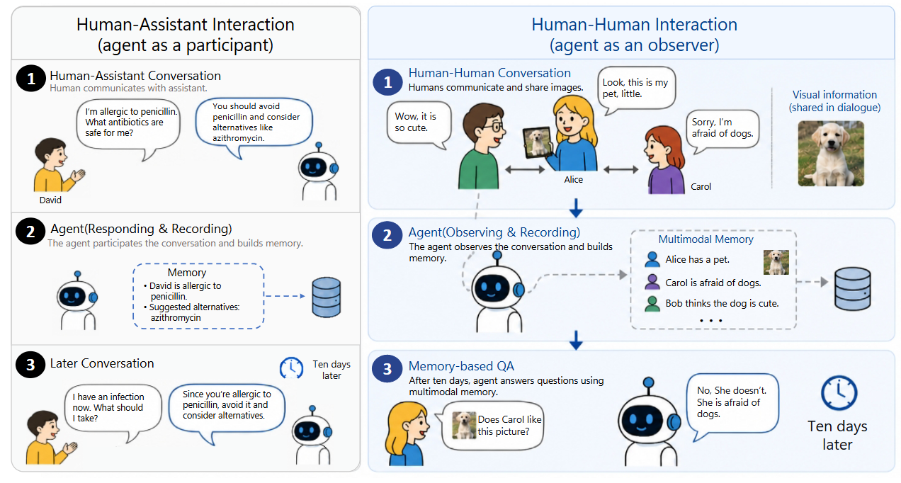
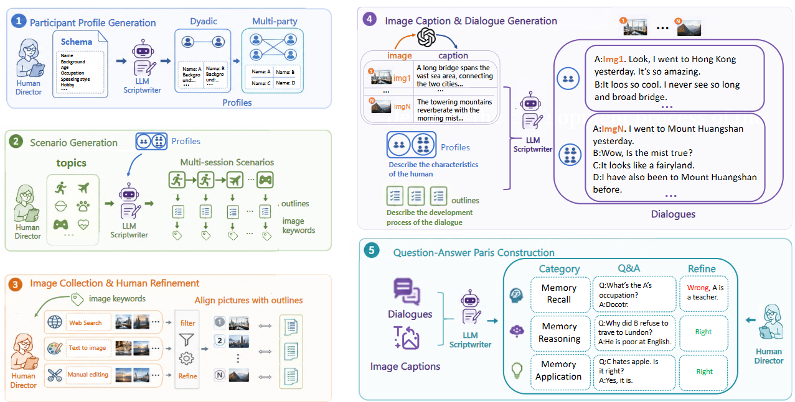
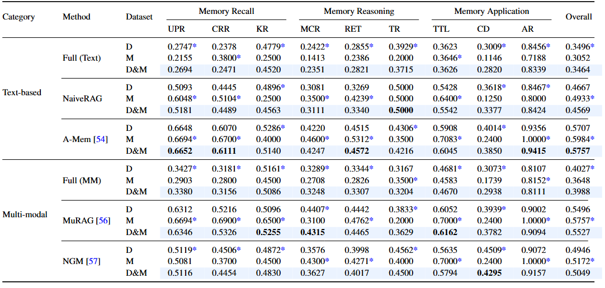

<h1 align="center">H2HMem: A Multimodal Memory Benchmark for Agents in Human-Human Interactions</h1>

<p align="center">
  H2HMem evaluates multimodal LLM memory in realistic <b>human-to-human interactions</b>,
  spanning both <b>dyadic</b> and <b>multi-party</b> conversations with diverse multimodal memory challenges.
</p>

<p align="center">
  <a href="https://arxiv.org/abs/2606.09461v1">📄 Paper</a> •
  <a href="https://huggingface.co/datasets/varib/H2HMEM">🤗 Hugging Face Dataset</a> •
  <a href="https://h2hmemleaderboard1.vercel.app/">🏆 Leaderboard</a> •
  <a href="https://h2hmemprojectpage.vercel.app/">🌐 Project Page</a> •
  <a href="./leaderboard/prediction_template.txt">📦 Submission Template</a>
</p>

<p align="center">
  
  
  
  
  
  
</p>

<p align="center">
⭐ If you find H2HMem useful, please consider starring the repository to help others discover the benchmark.
</p>

---

<p align="center">
  
</p>

<p align="center">
  <em>
    Unlike traditional human–assistant settings (left), H2HMem evaluates LLM agents as <b>observers in human–human interactions</b> (right),
    where agents must process multimodal conversations, resolve complex discourse phenomena (anaphora, deixis),
    and handle asynchronous or conflicting information from multiple participants.
  </em>
</p>

---

## ✨ What is H2HMem?

Most memory benchmarks ask a simple question:

> **Can the agent remember information from past interactions?**

H2HMem asks a more deployment-relevant one:

> **Can the agent observe, retain, and utilize multimodal information from complex human–human conversations, spanning multiple participants, sessions, and modalities?**

This matters in emerging real-world applications where LLM agents act as **observers in human–human interactions**, such as:

- 🩺 **Clinical documentation:** Generating patient-centered notes from clinician–patient dialogues.
- 🏥 **Medical board meetings:** Processing multimodal inputs from AI-powered medical meeting assistants.
- 📋 **Meeting summarization:** Summarizing general multi-party meetings with cross-modal references.
- 🗣️ **Multi-party discourse:** Tracking information distributed across multiple participants over extended interactions.

These environments introduce three fundamental challenges:

| Challenge | Description |
|---|---|
| **Multimodality** | Conversations naturally interleave text with visual content (photos, screenshots). |
| **Complex Discourse** | Phenomena like anaphora and discourse deixis require reference resolution against evolving memory. |
| **Asynchronous & Conflicting Information** | Multiple participants may provide inconsistent or contradictory information. |

H2HMem evaluates three core memory capabilities across nine task types:

| Capability | Task Types | What it Tests |
|---|---|---|
| **Memory Recall** | UPR, CRR, KR | Can the agent accurately retrieve information from past dialogues? |
| **Memory Reasoning** | TR, MCR, RET | Can the agent reason over temporal, causal, and evolving references? |
| **Memory Application** | TTL, CD, AR | Can the agent apply learned information, detect conflicts, and refuse when appropriate? |

---

## 📌 Benchmark at a Glance

| Property | Value |
|---|---|
| **Dialogues** | 25 (20 dyadic + 5 multi-party) |
| **Sessions** | 309 (284 dyadic + 25 multi-party) |
| **Dialogue Rounds** | 7,078 |
| **Images** | 1,300 |
| **QA Pairs** | 2,236 |
| **Task Categories** | Memory Recall, Memory Reasoning, Memory Application |
| **Task Types** | 9 (UPR, CRR, KR, TR, MCR, RET, TTL, CD, AR) |
| **Modalities** | Text + Image (Multimodal) |
| **Metrics** | Lexical Metrics, LLM-as-a-Judge |

---

## 🧠 Why H2HMem?

Existing memory benchmarks largely focus on **single-user, text-only interactions**, where an agent recalls information from its own past interactions with a single user. However, a new class of applications is emerging: **LLM agents as observers in human–human interactions**.

Unlike traditional human–assistant settings, these environments:

- Are **inherently multimodal**, interleaving text with visual content such as shared photographs and screenshots.
- Involve **complex discourse phenomena** such as anaphora and deixis, requiring agents to resolve references against evolving conversational memory.
- Contain **asynchronous or conflicting information** from multiple participants.
- Require tracking information **across multiple participants, sessions, and modalities**.

This makes H2HMem fundamentally different from prior benchmarks that focus on single-agent recall, personalization, or long-context understanding in isolation. Experiments with advanced agents reveal **substantial limitations** in constructing, retaining, and utilizing memories across modalities, participants, and sessions, highlighting substantial room for improvement in next-generation LLM agents.

---

## 🏗️ Benchmark Construction Pipeline

<p align="center">
  
</p>

<p align="center">
  <em>
    H2HMem is constructed from dyadic and multi-party human-human conversations with multimodal inputs,
    structured into multiple sessions with diverse QA tasks spanning recall, reasoning, and application.
  </em>
</p>

---

## 📊 Main Results

We evaluate multiple baseline methods on H2HMem across text-based and multimodal approaches.

<p align="center">
  
</p>

<p align="center">
  <em>
    LLM-as-a-judge evaluation results across task types and methods.
  </em>
</p>

---

## 📥 Dataset Download

Download the dataset from Hugging Face:

🤗 **[Hugging Face Dataset](https://huggingface.co/datasets/varib/H2HMEM)**

Save the contents to the following local folders:

- `./dataset/dyadic`
- `./dataset/multi-party`

---

## ⚙️ Installation

```bash
git clone https://github.com/varib1/H2HMEM.git
cd H2HMEM
pip install -r requirements.txt
```

## 🧪 Inference

This repository supports both **text-based** and **multimodal** memory methods.

### 📝 Text-based Methods

Text-based methods first convert images into textual captions, then perform evaluation using the corresponding baseline.

**Step 1 — Generate Image Captions**

```bash
bash ./caption/run_caption.sh
```

**Step 2 — Run Evaluation**

| Method | Command |
|:--|:--|
| **Full (Text)** | `bash ./baselines/FullText/evaluate.sh` |
| **Naive RAG** | `bash ./baselines/Naive_RAG/evaluate.sh` |
| **A-MEM** | `bash ./baselines/A-MEM/memory_construct.sh` (build memory)<br>`bash ./baselines/A-MEM/evaluate.sh` (run evaluation) |

### 🖼️ Multimodal Methods

Multimodal methods directly process image-text inputs and do **not** require caption generation.

| Method | Command |
|:--|:--|
| **Full (MM)** | `bash ./baselines/FullMM/evaluate.sh` |
| **MuRAG** | `bash ./baselines/MuRAG/evaluate.sh` |
| **NGM** | `bash ./baselines/NGM/evaluate.sh` |

---

## 📈 Metrics Evaluation

After inference, evaluate the generated responses using the following metrics.

### 🔤 Lexical Metrics

```bash
bash ./evaluate_metrics/Lexical_metrics/run_Lexical_metrics.sh
```

### 🤖 LLM-as-a-Judge

```bash
bash ./evaluate_metrics/LLM-as-judge/run_LLM_as_judge.sh
```

### 📌 Notes

- Text-based methods require an additional caption generation stage.
- Multimodal methods directly consume image-text inputs.
- All evaluation scripts automatically save outputs to their corresponding result directories.

---

## 🏆 Leaderboard Submission

We provide an online leaderboard for evaluating memory methods on H2HMem:

🏆 [H2HMem Leaderboard](https://h2hmemleaderboard1.vercel.app/)

### Submission Workflow

1. Run inference on the dyadic and multi-party datasets.
2. Format your predictions according to the submission template.
3. Upload the files to the leaderboard website.

### 📦 Submission Format

We provide a JSON template file that defines the required submission format:

- [`leaderboard/prediction_template.txt`](leaderboard/prediction_template.txt) — Template for submission format

Your final submission should include two JSON files:

```text
prediction_dyadic.json
prediction_multiparty.json
```

### 📤 Submit to Leaderboard

1. Open the 🏆 [H2HMem Leaderboard](https://h2hmemleaderboard1.vercel.app/).
2. Upload `prediction_dyadic.json` and `prediction_multiparty.json`.
3. Fill in method metadata: method name, organization / affiliation (optional), and additional description (optional).
4. Submit your results.

Your submission needs to be reviewed by an administrator before it appears on the public leaderboard.

### 📌 Submission Notes

- Please ensure the prediction files strictly follow the provided JSON format.
- Both dyadic and multi-party prediction files are required for complete evaluation.
- We recommend preserving original model outputs before post-processing for reproducibility.

---

## 📚 Citation

If you use H2HMem, please cite the accompanying paper.

```bibtex
@misc{zhu2026h2hmemmultimodalmemorybenchmark,
      title={H2HMem: A Multimodal Memory Benchmark for Agents in Human-Human Interactions}, 
      author={Shiping Zhu and Yibo Yang and Zhengyang Wang and Tiancheng Shen and Dandan Guo and Ming-Hsuan Yang},
      year={2026},
      eprint={2606.09461},
      archivePrefix={arXiv},
      primaryClass={cs.CL},
      url={https://arxiv.org/abs/2606.09461}, 
}
```